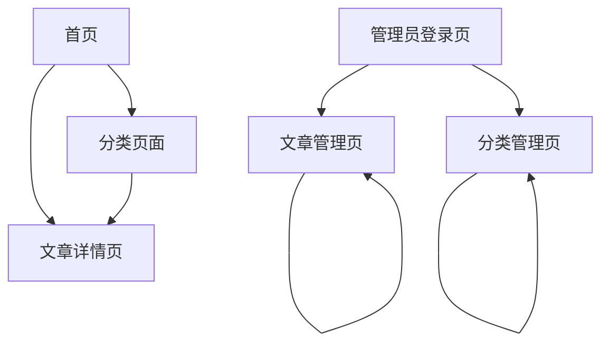

## 1. Product Overview

个人博客网站是一个展示文章内容、支持分类管理和后台管理的现代化博客平台。

* 主要解决个人内容创作者的文章发布、分类整理和内容管理需求，为访客提供优质的阅读体验。

* 目标是打造一个具有古朴简洁美学风格的高品质博客平台，结合现代交互动效提升用户体验。

## 2. Core Features

### 2.1 User Roles

| Role | Registration Method | Core Permissions |
| ---- | ------------------- | ---------------- |
| 访客用户 | 无需注册                | 浏览文章、查看分类、搜索内容   |
| 管理员  | 预设管理员账户登录           | 文章管理、分类管理、内容发布   |

### 2.2 Feature Module

我们的个人博客需求包含以下主要页面：

1. **首页**：英雄区域、导航菜单、精选文章列表、分类导航
2. **文章详情页**：文章内容展示、相关文章推荐、返回导航
3. **分类页面**：分类列表、分类下的文章展示、筛选功能
4. **管理员登录页**：登录表单、身份验证
5. **文章管理页**：文章列表、新增编辑删除、发布状态管理
6. **分类管理页**：分类列表、新增编辑删除分类

### 2.3 Page Details

| Page Name | Module Name | Feature description        |
| --------- | ----------- | -------------------------- |
| 首页        | 英雄区域        | 展示超大标题和副标题，包含视差滚动效果和动画入场   |
| 首页        | 导航菜单        | 顶部固定导航，包含首页、分类、关于等链接       |
| 首页        | 精选文章        | 展示最新或推荐文章卡片，支持hover动效和点击跳转 |
| 首页        | 分类导航        | 显示主要文章分类，支持快速筛选            |
| 文章详情页     | 文章内容        | 展示完整文章内容，支持富文本格式和代码高亮      |
| 文章详情页     | 相关推荐        | 显示相关文章列表，支持点击跳转            |
| 文章详情页     | 导航控制        | 返回按钮、上一篇下一篇文章导航            |
| 分类页面      | 分类列表        | 展示所有文章分类，支持点击查看分类下文章       |
| 分类页面      | 文章展示        | 显示选中分类下的文章列表，支持分页          |
| 分类页面      | 筛选功能        | 按时间、标题等条件筛选文章              |
| 管理员登录页    | 登录表单        | 用户名密码输入，登录验证和错误提示          |
| 管理员登录页    | 身份验证        | 验证管理员身份，设置登录状态             |
| 文章管理页     | 文章列表        | 显示所有文章，支持搜索、排序、分页          |
| 文章管理页     | 文章操作        | 新增、编辑、删除文章，富文本编辑器          |
| 文章管理页     | 发布管理        | 设置文章发布状态、发布时间、分类标签         |
| 分类管理页     | 分类列表        | 显示所有分类，支持层级展示              |
| 分类管理页     | 分类操作        | 新增、编辑、删除分类，设置分类描述          |

## 3. Core Process

**访客用户流程：**
用户访问首页浏览精选内容 → 点击文章进入详情页阅读 → 通过分类页面查找特定主题文章 → 在分类页面筛选和浏览相关内容

**管理员流程：**
管理员登录验证身份 → 进入文章管理页面查看所有文章 → 新增或编辑文章内容 → 在分类管理页面维护分类结构 → 发布文章供访客浏览

## 4. User Interface Design

### 4.1 Design Style

* **主色调**：#F8F9FA (浅灰白色背景)，#2C3E50 (深灰色文字)

* **强调色**：#3498DB (蓝色链接)，#E74C3C (重要按钮)

* **按钮样式**：简洁线条风格，圆角边框，hover渐变效果

* **字体**：Google Fonts - Noto Serif SC (中文衬线)，Playfair Display (英文标题)，Source Sans Pro (英文正文)

* **字体大小**：超大标题 4rem-6rem，正文 1rem，小字 0.875rem

* **布局风格**：卡片式布局，大量留白，顶部固定导航

* **图标风格**：Font Awesome 线条图标，避免填充样式

### 4.2 Page Design Overview

| Page Name | Module Name | UI Elements                                      |
| --------- | ----------- | ------------------------------------------------ |
| 首页        | 英雄区域        | 超大中文标题(6rem粗体)，英文副标题(1.5rem细体)，视差背景，anime.js淡入动画 |
| 首页        | 导航菜单        | 顶部固定，半透明背景，线条图标，hover动效                          |
| 首页        | 精选文章        | 卡片布局，阴影效果，hover上浮动画，标题大字体                        |
| 文章详情页     | 文章内容        | 大字体标题，衬线字体正文，代码块高亮，段落间距适中                        |
| 分类页面      | 分类列表        | 网格布局，每个分类卡片包含图标和文章数量                             |
| 管理页面      | 表单控件        | 简洁输入框，线条按钮，表格样式统                                 |

