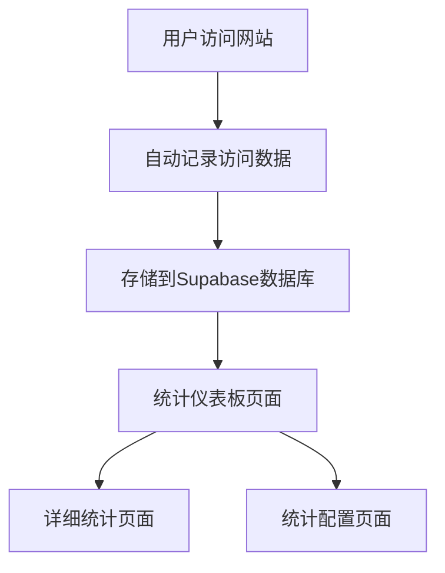

# 简单本地统计系统产品需求文档

## 1. 产品概述

设计一个简单的统计系统，替代Google Analytics，解决网络连接限制问题。
- 提供基础的页面访问统计功能，包括页面浏览量、用户访问量、访问时间等核心指标。
- 数据存储在Supabase云数据库中，提供稳定可靠的云端统计服务，确保数据的安全性和可扩展性。

## 2. 核心功能

### 2.1 用户角色

| 角色 | 注册方式 | 核心权限 |
|------|----------|----------|
| 默认用户 | 无需注册 | 可浏览网站内容，自动记录访问数据 |
| 管理员 | 管理员登录 | 可查看统计数据，管理统计配置 |

### 2.2 功能模块

我们的简单统计系统包含以下主要页面：
1. **统计仪表板页面**：数据概览、图表展示、关键指标卡片。
2. **详细统计页面**：页面访问详情、用户行为分析、时间趋势图。
3. **统计配置页面**：统计开关设置、数据清理选项。

### 2.3 页面详情

| 页面名称 | 模块名称 | 功能描述 |
|----------|----------|----------|
| 统计仪表板页面 | 数据概览 | 显示总访问量、今日访问量、独立访客数等关键指标，数据存储在Supabase |
| 统计仪表板页面 | 图表展示 | 展示访问趋势图、热门页面排行、访问来源分布，通过Supabase实时查询 |
| 统计仪表板页面 | 关键指标卡片 | 实时显示当前在线用户数、平均停留时间、跳出率，数据来源Supabase |
| 详细统计页面 | 页面访问详情 | 列表显示各页面的访问次数、独立访客、平均停留时间，存储在Supabase表中 |
| 详细统计页面 | 用户行为分析 | 显示用户访问路径、点击热力图、设备类型分布，基于Supabase数据分析 |
| 详细统计页面 | 时间趋势图 | 按小时、天、周、月展示访问量变化趋势，查询Supabase历史数据 |
| 统计配置页面 | 统计开关设置 | 启用/禁用统计功能、选择统计范围、设置数据保留期，配置存储在Supabase |
| 统计配置页面 | 数据清理选项 | 清空Supabase历史数据、导出统计报告、重置统计计数器 |

## 3. 核心流程

**用户访问流程**：
用户访问网站 → 自动记录访问数据（页面URL、访问时间、用户标识、设备信息）→ 数据存储到Supabase云数据库 → 管理员可在统计页面查看数据

**管理员查看流程**：
管理员登录 → 进入统计仪表板 → 查看数据概览和图表 → 点击详细统计查看更多信息 → 在配置页面管理统计设置

## 4. 用户界面设计

### 4.1 设计风格

- **主色调**：蓝色系（#3B82F6）和灰色系（#6B7280）
- **辅助色**：绿色（#10B981）表示正向数据，橙色（#F59E0B）表示警告
- **按钮样式**：圆角按钮，悬停时有阴影效果
- **字体**：系统默认字体，标题16px，正文14px，数据展示18px
- **布局风格**：卡片式布局，顶部导航，左侧边栏（可选），与现有博客系统保持一致
- **图标风格**：简洁的线性图标，统一的视觉风格
- **数据加载**：显示Supabase连接状态，加载动画

### 4.2 页面设计概览

| 页面名称 | 模块名称 | UI元素 |
|----------|----------|--------|
| 统计仪表板页面 | 数据概览 | 4个数据卡片，显示总访问量、今日访问、独立访客、平均停留时间，使用大号数字和图标 |
| 统计仪表板页面 | 图表展示 | 折线图显示7天访问趋势，柱状图显示热门页面TOP5，饼图显示设备类型分布 |
| 详细统计页面 | 页面访问详情 | 表格形式展示，包含页面标题、URL、访问次数、独立访客等列，支持排序和搜索 |
| 统计配置页面 | 统计开关设置 | 开关按钮、下拉选择框、日期选择器，简洁的表单布局 |

### 4.3 响应式设计

桌面优先设计，支持移动端自适应，在小屏幕设备上图表和表格会自动调整布局，确保数据的可读性。