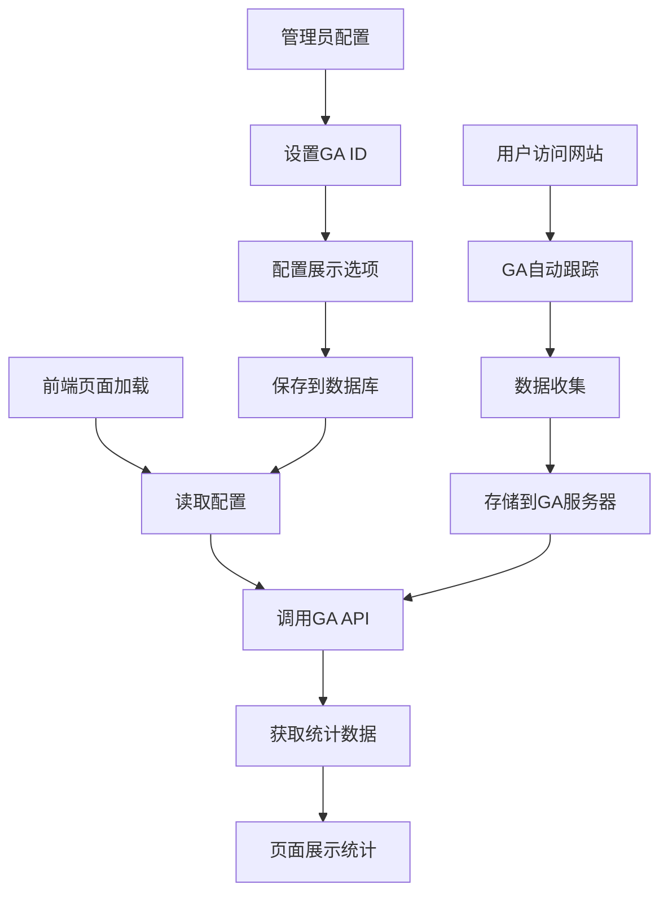

# 网站访问量统计功能需求文档

## 1. 产品概述

为个人技术博客网站添加访问量统计功能，采用 Google Analytics 4 + 前端展示的零成本方案，帮助网站主了解访问情况并为访客提供有价值的统计信息。

* 解决问题：缺乏网站访问数据分析，无法了解内容受欢迎程度和用户行为

* 目标用户：网站管理员（数据分析）和网站访客（统计信息展示）

* 产品价值：提升网站专业度，优化内容策略，增强用户体验

## 2. 核心功能

### 2.1 用户角色

| 角色    | 权限说明     | 核心功能                   |
| ----- | -------- | ---------------------- |
| 网站管理员 | 完整数据访问权限 | 查看详细统计数据、配置统计设置、管理展示内容 |
| 普通访客  | 基础统计信息查看 | 查看网站基础统计数据、文章阅读量等公开信息  |

### 2.2 功能模块

本需求包含以下核心页面和功能：

1. **统计数据收集**：Google Analytics 4 集成，自动收集访问数据
2. **首页统计展示**：网站总访问量、文章总数、分类总数的可视化展示
3. **关于页面增强**：详细的网站统计信息和数据可视化
4. **文章页面统计**：单篇文章的阅读量展示和相关推荐
5. **管理后台配置**：统计功能的开关和展示设置管理

### 2.3 页面详情

| 页面名称     | 模块名称                | 功能描述                                     |
| -------- | ------------------- | ---------------------------------------- |
| 首页       | 统计概览卡片              | 显示网站总访问量、文章总数、分类总数，使用动画效果展示数字变化          |
| 首页       | Google Analytics 集成 | 自动跟踪页面访问、用户行为，收集基础统计数据                   |
| 关于页面     | 详细统计面板              | 展示网站运行天数、累计访问量、热门文章排行、访问趋势图表             |
| 关于页面     | 数据可视化组件             | 使用图表展示访问数据趋势、文章分类分布、用户来源分析               |
| 文章详情页    | 阅读量显示               | 显示当前文章的阅读次数，实时更新访问统计                     |
| 文章详情页    | 相关文章推荐              | 基于访问数据推荐热门相关文章，提升用户停留时间                  |
| 管理后台     | 统计配置管理              | 配置 Google Analytics ID、设置统计展示开关、管理数据展示权限 |
| 管理后台     | 数据同步功能              | 从 Google Analytics 同步数据到本地数据库，支持离线展示     |
| Footer组件 | 访问计数器               | 显示网站总访问次数，简洁的数字展示                        |

## 3. 核心流程

### 3.1 数据收集流程

用户访问网站 → Google Analytics 自动跟踪 → 收集页面访问、用户行为、来源等数据 → 存储到 Google Analytics 服务器

### 3.2 数据展示流程

管理员配置 GA ID → 前端组件调用 GA API → 获取统计数据 → 在各页面展示相应统计信息 → 用户查看统计数据

### 3.3 管理员配置流程

登录管理后台 → 进入统计配置页面 → 设置 Google Analytics ID → 配置展示选项 → 保存配置 → 前端自动应用新配置



## 4. 用户界面设计

### 4.1 设计风格

* **主色调**：沿用网站现有的蓝色系（#3B82F6）和灰色系（#6B7280）

* **辅助色彩**：绿色（#10B981）表示增长，橙色（#F59E0B）表示警告

* **组件风格**：圆角卡片设计，与现有网站风格保持一致

* **字体**：继续使用 Inter 和 Noto Serif SC 字体组合

* **图标风格**：使用 Lucide React 图标库，保持简洁现代风格

* **动画效果**：数字滚动动画、渐入效果，提升用户体验

### 4.2 页面设计概览

| 页面名称   | 模块名称   | UI元素                                |
| ------ | ------ | ----------------------------------- |
| 首页     | 统计概览卡片 | 3列网格布局，每个卡片包含图标、数字、标题，使用渐变背景和阴影效果   |
| 关于页面   | 统计面板   | 2x2网格布局，包含运行天数、访问量、文章数、用户数，使用动画数字效果 |
| 关于页面   | 图表组件   | 折线图显示访问趋势，饼图显示文章分类分布，柱状图显示热门文章      |
| 文章详情页  | 阅读量标签  | 小型徽章样式，显示眼睛图标和阅读数字，位于文章标题下方         |
| 管理后台   | 配置表单   | 简洁的表单设计，包含输入框、开关按钮、保存按钮，使用卡片布局      |
| Footer | 访问计数器  | 简单的文字显示，"总访问量: XXX"，使用小号字体          |

### 4.3 响应式设计

* **设计优先级**：移动端优先，桌面端适配

* **断点设置**：sm(640px), md(768px), lg(1024px), xl(1280px)

* **移动端优化**：统计卡片垂直堆叠，图表自适应屏幕宽度，触摸友好的交互设计

* **桌面端增强**：多列布局展示更多信息，鼠标悬停效果，更大的图表展示区域

## 5. 技术实现方案

### 5.1 技术栈

* **前端框架**：React 18 + TypeScript

* **样式方案**：Tailwind CSS

* **数据可视化**：Chart.js 或 Recharts

* **统计服务**：Google Analytics 4

* **数据存储**：Supabase PostgreSQL（配置和缓存）

* **部署平台**：netlify

### 5.2 核心组件设计

```typescript
// 统计数据类型定义
interface AnalyticsData {
  totalViews: number;
  todayViews: number;
  totalArticles: number;
  totalCategories: number;
  popularArticles: Array<{id: string, title: string, views: number}>;
  viewsTrend: Array<{date: string, views: number}>;
}

// 统计配置类型
interface AnalyticsConfig {
  gaTrackingId: string;
  enablePublicStats: boolean;
  showViewsOnArticles: boolean;
  enableTrendCharts: boolean;
}
```

### 5.3 实施步骤

**阶段一：基础集成（1-2天）**

1. 在 index.html 中集成 Google Analytics 4
2. 创建统计配置管理功能
3. 在管理后台添加 GA 配置页面

**阶段二：数据展示（2-3天）**

1. 开发统计数据获取 API
2. 创建首页统计概览组件
3. 在 Footer 添加访问计数器

**阶段三：功能增强（2-3天）**

1. 开发关于页面详细统计面板
2. 添加文章页面阅读量显示
3. 实现数据可视化图表

**阶段四：优化完善（1-2天）**

1. 添加动画效果和交互优化
2. 响应式设计调整
3. 性能优化和错误处理

### 5.4 数据隐私和合规

* **GDPR 合规**：添加 Cookie 同意横幅

* **数据匿名化**：不收集个人身份信息

* **用户控制**：提供统计功能开关选项

* **透明度**：在隐私政策中说明数据收集用途

## 6. 成功指标

### 6.1 技术指标

* Google Analytics 成功集成并收集数据

* 统计数据在各页面正确显示

* 页面加载性能不受影响（<100ms 延迟）

* 移动端和桌面端完美适配

### 6.2 用户体验指标

* 统计信息增强网站专业度

* 访客能够了解网站活跃度

* 管理员能够获得有价值的数据洞察

* 不影响现有用户体验

### 6.3 业务价值

* 了解热门内容，优化内容策略

* 分析用户来源，改进推广方式

* 提升网站可信度和专业形象

* 为未来功能开发提供数

